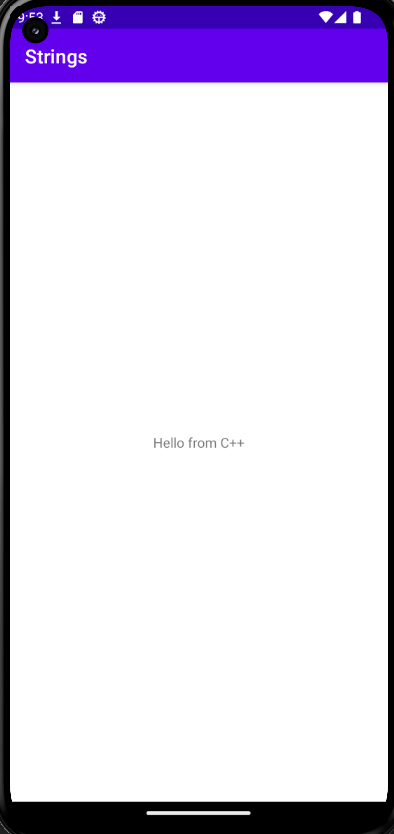
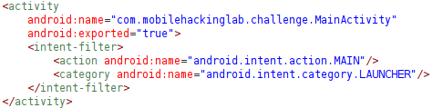
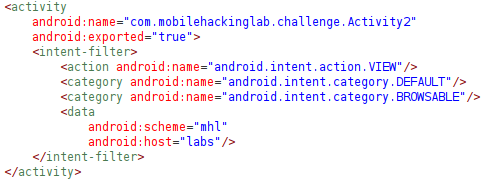
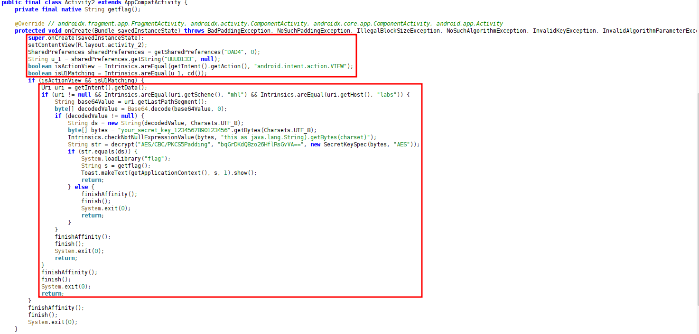
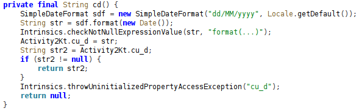
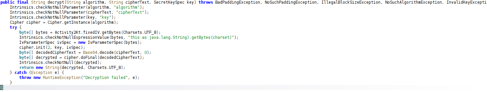
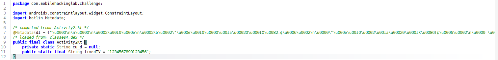
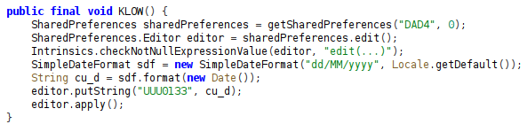
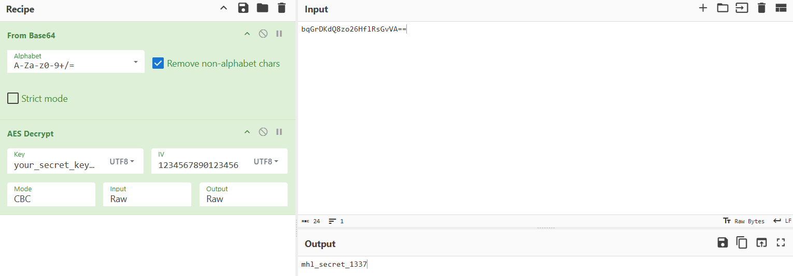

# Strings

## Hints and Rules

- Reverse engineer the application and search for exported activities.
- Understand the code and find a method to invoke the exported activity.
- Utilize Frida for tracing or employ Frida's memory scanning.
- Don't have to spend time on static analysis of the Android library, as the code is obfuscated.
- The flag follows the format "MHL{...}".
- Do not attempt to patch the application.

## Reconnaissance

Opening the application we are greeted with a text `Hello from C++`.



Opening the application in JADX:

1. We found two exported activities with intent filters in the `AndroidManifest.xml`:

   - `com.mobilehackinglab.challenge.MainActivity`

        

        ```xml
        <activity
            android:name="com.mobilehackinglab.challenge.MainActivity"
            android:exported="true">
            <intent-filter>
                <action android:name="android.intent.action.MAIN"/>
                <category android:name="android.intent.category.LAUNCHER"/>
            </intent-filter>
        </activity>
        ```

        This is the main activity that launches when the app starts. The activity is exported, allowing it to be launched by other applications.

   - `com.mobilehackinglab.challenge.Activity2`

        

        ```xml
        <activity
            android:name="com.mobilehackinglab.challenge.Activity2"
            android:exported="true">
            <intent-filter>
                <action android:name="android.intent.action.VIEW"/>
                <category android:name="android.intent.category.DEFAULT"/>
                <category android:name="android.intent.category.BROWSABLE"/>
                <data
                    android:scheme="mhl"
                    android:host="labs"/>
            </intent-filter>
        </activity>
        ```

        This activity is also exported and can be launched by other applications. It listens for intents with the action `android.intent.action.VIEW` and the data scheme `mhl` and host `labs`.

        To properly trigger this activity, we can use the following ADB command:

        ```bash
        adb shell am start -a android.intent.action.VIEW -d "mhl://labs" -n com.mobilehackinglab.challenge/.Activity2
        ```

2. After we found the `com.mobilehackinglab.challenge.Activity2` exported activity, we can analyze its code to understand what actually happens if we trigger said exported activity.

    In the `Activity2` class, we can see a function called `onCreate` that is executed when the activity is created:

    

    Here's one of the snippet of the `onCreate` function:

    ```java
    protected void onCreate(Bundle savedInstanceState) throws BadPaddingException, NoSuchPaddingException, IllegalBlockSizeException, NoSuchAlgorithmException, InvalidKeyException, InvalidAlgorithmParameterException {
        super.onCreate(savedInstanceState);
        setContentView(R.layout.activity_2);
        SharedPreferences sharedPreferences = getSharedPreferences("DAD4", 0);
        String u_1 = sharedPreferences.getString("UUU0133", null);
        boolean isActionView = Intrinsics.areEqual(getIntent().getAction(), "android.intent.action.VIEW");
        boolean isU1Matching = Intrinsics.areEqual(u_1, cd());
    ...
    ```

    The code retrieves a value from `SharedPreferences` with the key `UUU0133` and stores it in the variable `u_1`. It then checks if the intent action is `android.intent.action.VIEW` and if `u_1` matches the result of the function `cd()`.

    Next, the other snippet of the `onCreate` function that continues from above:

    ```java
    if (isActionView && isU1Matching) {
        Uri uri = getIntent().getData();
        if (uri != null && Intrinsics.areEqual(uri.getScheme(), "mhl") && Intrinsics.areEqual(uri.getHost(), "labs")) {
            String base64Value = uri.getLastPathSegment();
            byte[] decodedValue = Base64.decode(base64Value, 0);
            if (decodedValue != null) {
                String ds = new String(decodedValue, Charsets.UTF_8);
                byte[] bytes = "your_secret_key_1234567890123456".getBytes(Charsets.UTF_8);
                Intrinsics.checkNotNullExpressionValue(bytes, "this as java.lang.String).getBytes(charset)");
                String str = decrypt("AES/CBC/PKCS5Padding", "bqGrDKdQ8zo26HflRsGvVA==", new SecretKeySpec(bytes, "AES"));
                if (str.equals(ds)) {
                    System.loadLibrary("flag");
                    String s = getflag();
                    Toast.makeText(getApplicationContext(), s, 1).show();
                    return;
                } else {
                    finishAffinity();
                    finish();
                    System.exit(0);
                    return;
                }
            }
            finishAffinity();
            finish();
            System.exit(0);
            return;
        }
        finishAffinity();
        finish();
        System.exit(0);
        return;
    }
    ...
    ```

    If both conditions are true, it retrieves the data from the intent and checks if the scheme is `mhl` and the host is `labs`. It then decodes the last path segment of the URI from Base64 and converts it to a string `ds`.

    The code then decrypts a hardcoded string `bqGrDKdQ8zo26HflRsGvVA==` using AES with a specific key and compares the result with `ds`. If they match, it loads a native library called `flag` and calls the `getflag()` function to retrieve the flag, which is then displayed in a toast message.

    Next, we need to analyze the `cd()` function to find out what value we need to store in `SharedPreferences` with the key `UUU0133` to pass the check.

    

    ```java
    private final String cd() {
        SimpleDateFormat sdf = new SimpleDateFormat("dd/MM/yyyy", Locale.getDefault());
        String str = sdf.format(new Date());
        Intrinsics.checkNotNullExpressionValue(str, "format(...)");
        Activity2Kt.cu_d = str;
        String str2 = Activity2Kt.cu_d;
        if (str2 != null) {
            return str2;
        }
        Intrinsics.throwUninitializedPropertyAccessException("cu_d");
        return null;
    }
    ```

    The `cd()` function returns the current date formatted as `dd/MM/yyyy`. This means that to pass the check, we need to store the current date in `SharedPreferences` with the key `UUU0133`.

    Next, let's check the `decrypt` function to understand how the decryption works.

    

    ```java
    public final String decrypt(String algorithm, String cipherText, SecretKeySpec key) throws BadPaddingException, NoSuchPaddingException, IllegalBlockSizeException, NoSuchAlgorithmException, InvalidKeyException, InvalidAlgorithmParameterException {
        Intrinsics.checkNotNullParameter(algorithm, "algorithm");
        Intrinsics.checkNotNullParameter(cipherText, "cipherText");
        Intrinsics.checkNotNullParameter(key, "key");
        Cipher cipher = Cipher.getInstance(algorithm);
        try {
            byte[] bytes = Activity2Kt.fixedIV.getBytes(Charsets.UTF_8);
            Intrinsics.checkNotNullExpressionValue(bytes, "this as java.lang.String).getBytes(charset)");
            IvParameterSpec ivSpec = new IvParameterSpec(bytes);
            cipher.init(2, key, ivSpec);
            byte[] decodedCipherText = Base64.decode(cipherText, 0);
            byte[] decrypted = cipher.doFinal(decodedCipherText);
            Intrinsics.checkNotNull(decrypted);
            return new String(decrypted, Charsets.UTF_8);
        } catch (Exception e) {
            throw new RuntimeException("Decryption failed", e);
        }
    }
    ```

    The `decrypt` function uses AES decryption with CBC mode and PKCS5 padding. It takes an algorithm, a Base64-encoded cipher text, and a secret key as parameters. It initializes the cipher with a fixed IV (initialization vector) and decrypts the provided cipher text.

3. Searching for the fixed IV used in the decryption process, we found it in the `Activity2Kt` class:

    

    ```java
    /* compiled from: Activity2.kt */
    @Metadata(d1 = {"\u0000\n\n\u0000\n\u0002\u0010\u000e\n\u0002\b\u0002\"\u000e\u0010\u0000\u001a\u00020\u0001X\u0082.¢\u0006\u0002\n\u0000\"\u000e\u0010\u0002\u001a\u00020\u0001X\u0086T¢\u0006\u0002\n\u0000¨\u0006\u0003"}, d2 = {"cu_d", "", "fixedIV", "app_debug"}, k = 2, mv = {1, 9, 0}, xi = ConstraintLayout.LayoutParams.Table.LAYOUT_CONSTRAINT_VERTICAL_CHAINSTYLE)
    /* loaded from: classes4.dex */
    public final class Activity2Kt {
        private static String cu_d = null;
        public static final String fixedIV = "1234567890123456";
    }
    ```

    The fixed IV used for decryption is `1234567890123456`.

4. We found a function called `KLOW` inside `MainActivity`:
    
    

    ```java
    private final void KLOW() {
        SharedPreferences sharedPreferences = getSharedPreferences("DAD4", 0);
        SharedPreferences.Editor editor = sharedPreferences.edit();
        SimpleDateFormat sdf = new SimpleDateFormat("dd/MM/yyyy", Locale.getDefault());
        String currentDate = sdf.format(new Date());
        Intrinsics.checkNotNullExpressionValue(currentDate, "format(...)");
        editor.putString("UUU0133", currentDate);
        editor.apply();
    }
    ```

    The `KLOW` function stores the current date in `SharedPreferences` with the key `UUU0133`, which is exactly what we need to pass the check in `Activity2`.

    We can use this `KLOW` function to set the required value in `SharedPreferences` before launching `Activity2`.

## Decrypting the Secret

In order to get the correct value to pass in the intent to `Activity2`, we need to decrypt the hardcoded string `bqGrDKdQ8zo26HflRsGvVA==` using the `decrypt` function with the key `your_secret_key_1234567890123456` and the fixed IV `1234567890123456`. We can use CyberChef to perform this decryption.



Using the same decryption method on `decrypt` function, that is AES decryption with CBC mode and PKCS5 padding, we get the decrypted string: `mhl_secret_1337`. 

From what we know from the `ds` function in `Activity2`, we need to Base64 encode this decrypted string to use it as the last path segment in the intent data. The Base64 encoded value of `mhl_secret_1337` is `bWhsX3NlY3JldF8xMzM3`.

## Exploitations
First, we need to launch the application and call the `KLOW` function to set the current date in `SharedPreferences`. But, before we start doing this, we need to push `frida-server` binary to the device and start it. Let's check the device architecture:

```pwsh
PS C:\Users\Dimas Herjunodarpito\Documents\MHL\LABS\Strings\frida-server-17.5.2-android-arm64> adb shell getprop ro.product.cpu.abi
x86_64
PS C:\Users\Dimas Herjunodarpito\Documents\MHL\LABS\Strings\frida-server-17.5.2-android-arm64> adb shell getprop ro.product.cpu.abilist
x86_64
PS C:\Users\Dimas Herjunodarpito\Documents\MHL\LABS\Strings\frida-server-17.5.2-android-arm64> adb shell uname -m
x86_64
PS C:\Users\Dimas Herjunodarpito\Documents\MHL\LABS\Strings\frida-server-17.5.2-android-arm64> adb shell getprop ro.zygote
zygote64
PS C:\Users\Dimas Herjunodarpito\Documents\MHL\LABS\Strings\frida-server-17.5.2-android-arm64>
```

The device architecture is `x86_64`, so we need to use the `frida-server` binary for `x86_64` architecture. Now, let's push the `frida-server` binary to the device and start it:

```pwsh
PS C:\Users\Dimas Herjunodarpito\Documents\MHL\LABS\Strings\frida-server-17.5.2-android-x86_64> adb root
restarting adbd as root
PS C:\Users\Dimas Herjunodarpito\Documents\MHL\LABS\Strings\frida-server-17.5.2-android-x86_64> adb push frida-server /data/local/tmp/
frida-server: 1 file pushed, 0 skipped. 54.7 MB/s (110713240 bytes in 1.931s)
PS C:\Users\Dimas Herjunodarpito\Documents\MHL\LABS\Strings\frida-server-17.5.2-android-x86_64> adb shell "chmod 775 /data/local/tmp/frida-server"
PS C:\Users\Dimas Herjunodarpito\Documents\MHL\LABS\Strings\frida-server-17.5.2-android-x86_64 adb shell "/data/local/tmp/frida-server &"
```

Now that `frida-server` is running on the device, we can launch the application using `frida`:

```pwsh
PS C:\Users\Dimas Herjunodarpito> frida -U -f com.mobilehackinglab.challenge
     ____
    / _  |   Frida 17.5.2 - A world-class dynamic instrumentation toolkit
   | (_| |
    > _  |   Commands:
   /_/ |_|       help      -> Displays the help system
   . . . .       object?   -> Display information about 'object'
   . . . .       exit/quit -> Exit
   . . . .
   . . . .   More info at https://frida.re/docs/home/
   . . . .
   . . . .   Connected to Android Emulator 5554 (id=emulator-5554)
Spawned `com.mobilehackinglab.challenge`. Resuming main thread!
[Android Emulator 5554::com.mobilehackinglab.challenge ]->
```

Let's switch to `objection` to start the application:

```pwsh
PS C:\Users\Dimas Herjunodarpito> objection -n $(adb shell pidof com.mobilehackinglab.challenge) start
Checking for a newer version of objection...

     _   _         _   _
 ___| |_|_|___ ___| |_|_|___ ___
| . | . | | -_|  _|  _| | . |   |
|___|___| |___|___|_| |_|___|_|_|
      |___|(object)inject(ion) v1.12.2

     Runtime Mobile Exploration
        by: @leonjza from @sensepost

[tab] for command suggestions
7335 (run) on (Android: 13) [usb] #
```

Let's list class methods/functions on `MainActivity` to find the `KLOW` function:

```pwsh
PS C:\Users\Dimas Herjunodarpito> objection -n $(adb shell pidof com.mobilehackinglab.challenge) start
Checking for a newer version of objection...

     _   _         _   _
 ___| |_|_|___ ___| |_|_|___ ___
| . | . | | -_|  _|  _| | . |   |
|___|___| |___|___|_| |_|___|_|_|
      |___|(object)inject(ion) v1.12.2

     Runtime Mobile Exploration
        by: @leonjza from @sensepost

[tab] for command suggestions
7335 (run) on (Android: 13) [usb] # android hooking list class_methods com.mobilehackinglab.challenge.MainActivity
protected void com.mobilehackinglab.challenge.MainActivity.onCreate(android.os.Bundle)
public final native java.lang.String com.mobilehackinglab.challenge.MainActivity.stringFromJNI()
public final void com.mobilehackinglab.challenge.MainActivity.KLOW()

Found 3 method(s)
7335 (run) on (Android: 13) [usb] #
```

Alright, we have found the `KLOW` function. Based on what we know so far, we need to call this function to set the current date in `SharedPreferences`. But first, we need to find the live instance of the `MainActivity` class so we can call the `KLOW` function on that instance:

```pwsh
7335 (run) on (Android: 13) [usb] # android heap search instances com.mobilehackinglab.challenge.MainActivity
Class instance enumeration complete for com.mobilehackinglab.challenge.MainActivity
Hashcode  Class                                        toString()
--------  -------------------------------------------  --------------------------------------------------
 2162175  com.mobilehackinglab.challenge.MainActivity  com.mobilehackinglab.challenge.MainActivity@20fdff
7335 (run) on (Android: 13) [usb] #
```

We found the live instance of `MainActivity` with the hashcode `2162175`. This live instace hashcode will be used to call the `KLOW` function. Let's call the `KLOW` function now:

```pwsh
7335 (run) on (Android: 13) [usb] # android heap execute 2162175 KLOW
Handle 2162175 is to class
        com.mobilehackinglab.challenge.MainActivity
Executing method: KLOW()
7335 (run) on (Android: 13) [usb] #
```

The `KLOW` function has been executed successfully, it created a file named `shared_prefs/DAD4.xml` in the application's data directory that contains the current date in `SharedPreferences` with the key `UUU0133`. Let's verify it:

```pwsh
PS C:\Users\Dimas Herjunodarpito> adb shell cat /data/data/com.mobilehackinglab.challenge/shared_prefs/DAD4.xml
<?xml version='1.0' encoding='utf-8' standalone='yes' ?>
<map>
    <string name="UUU0133">08/01/2026</string>
</map>
PS C:\Users\Dimas Herjunodarpito>
```

The `KLOW` function worked as expected, now we have the current date stored in `SharedPreferences` with the key `UUU0133`.

Now that we have set the required value in `SharedPreferences`, we can proceed to launch the `Activity2` with the correct intent data to retrieve the flag. We will use the ADB command we found earlier, appending the Base64 encoded secret as the last path segment:

```bash
adb shell am start -a android.intent.action.VIEW -d "mhl://labs/bWhsX3NlY3JldF8xMzM3" -n com.mobilehackinglab.challenge/.Activity2
```

After executing the above command, we should see a toast message:


Oddly enough, the toast is not showing the flag. We need to perform a memory scan using `objection` to find the flag in memory.

```pwsh
7335 (run) on (Android: 13) [usb] # memory search "MHL{" --string
Searching for: 4d 48 4c 7b
7bd9affd6fc0  4d 48 4c 7b 49 4e 5f 54 48 45 5f 4d 45 4d 4f 52  MHL{IN_THE_MEMOR
7bd9affd6fd0  59 7d 00 00 00 00 00 00 00 00 00 00 00 00 00 00  Y}..............
7bd9affd6fe0  00 00 00 00 00 00 00 00 00 00 00 00 00 00 00 00  ................
Pattern matched at 1 addresses
7335 (run) on (Android: 13) [usb] #
```

Using `memory search` in `objection`, we managed to found the flag in memory. The flag is `MHL{IN_THE_MEMORY}`.
